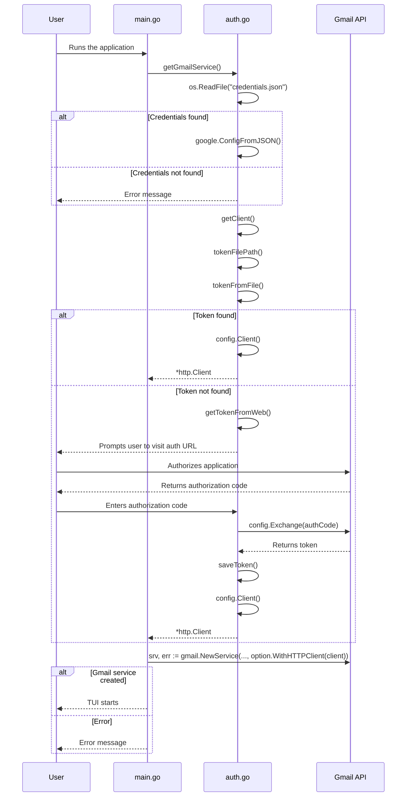

# Gmail TUI – Terminal Gmail Client

A feature-rich terminal interface for Gmail, combining the efficiency of CLI with the familiarity of Gmail's core functionality. Built with Go and BubbleTea for blazing-fast performance in your terminal.

## Features

**Key Highlights:**

- Full email management without leaving your terminal
- Secure OAuth2 authentication
- Keyboard-driven efficiency with vim-like navigation
- Lightweight alternative to web-based Gmail

## ✨ Features

- 📬 **Inbox Management**: View, search, and organize emails
- ✏️ **Compose & Reply**: Rich text composition with attachments
- 🏷️ **Label System**: Full Gmail label integration
- 📎 **Attachment Support**: Download and view attachments
- 🔍 **Advanced Search**: Gmail search operators support
- ⚡ **Offline Cache**: Basic offline functionality
- 🎨 **Themes**: Customizable color schemes

## 🛠 Installation

### Prerequisites

- Go 1.23+
- Gmail account
- Google Cloud Console Project with Gmail API enabled(beta)

### Quick Start

```bash
git clone https://github.com/rdx40/gmail-tui
cd gmail-tui
go mod download
```

### Generating OAuth Credentials

#### Step 1: Create a Project in Google Cloud Console

- Go to the Google Cloud Console
- Click the project dropdown (top-left) > New Project
- Enter a project name (e.g., "Gmail-TUI") > Create

#### Step 2: Enable Gmail API

- In the Cloud Console sidebar, navigate to APIs & Services > Library
- Search for "Gmail API" and select it
- Click Enable

#### Step 3: Configure OAuth Consent Screen

- Go to APIs & Services > OAuth consent screen
- In Audience Enter your email as test user
- Add all the fmail andrequired scopes in `Data Acess`
- Create a client
- Download the json and save as credentials.json in repo root

#### Step 4: First-Time Authorization

- Run your application with:

```bash
go run .
```

- It will:
- Open a browser window asking you to log in to Google
- Show a warning screen (click Continue)
- Grant permission to your app
- Then `CHECK URL FOR CODE AND THEN INPUT TO PROMPT IN TERMINAL`
- This will generate a `~/.gmail-tui-token.json` file for future authentications


## ⌨️ Key Bindings

| Key      | Action                 |
| -------- | ---------------------- |
| `j`/`k`  | Navigate emails        |
| `enter`  | Open selected email    |
| `c`      | Compose new email      |
| `r`      | Reply to current email |
| `d`      | Delete email           |
| `/`      | Search emails          |
| `l`      | Label management       |
| `ctrl+d` | Download attachment    |
| `?`      | Show help              |

## 🚀 Roadmap

- [ ] **Threaded Conversations** _(WIP)_
- [ ] **PGP Integration**
- [ ] **Custom Filter Rules**
- [ ] **Multi-Account Support**
- [ ] **Plugin System** (Python/Lua hooks)

## Authentication Flow


