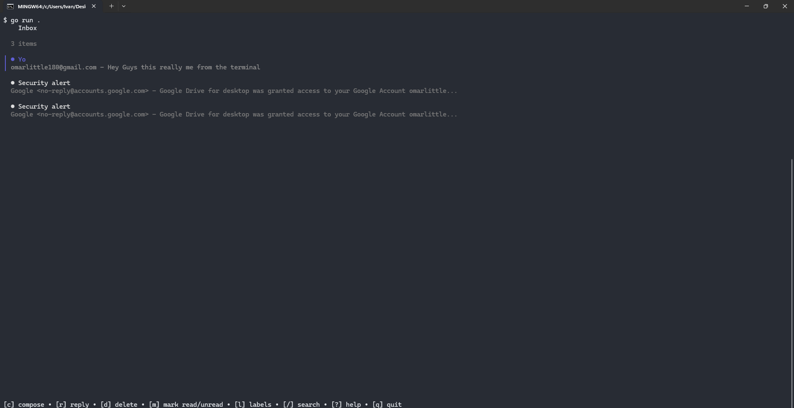
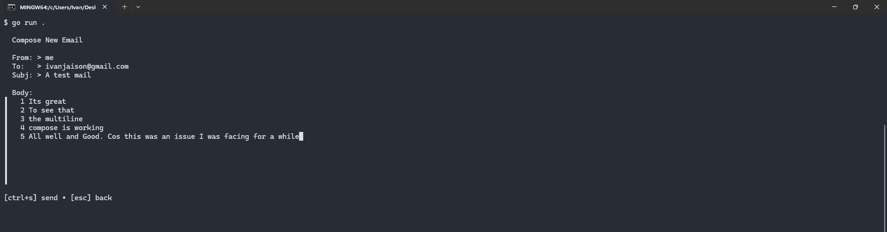

Currently only the basic functionality work
like compose a mail
read a mail
reply to a mail

Update (9th June) : Attachments have successfully been added

replace the credential.json with yours and

```bash
go run .
```

and wait till it starts

## how it looks:





### ps first run always takes a bit longer but after that its chill
