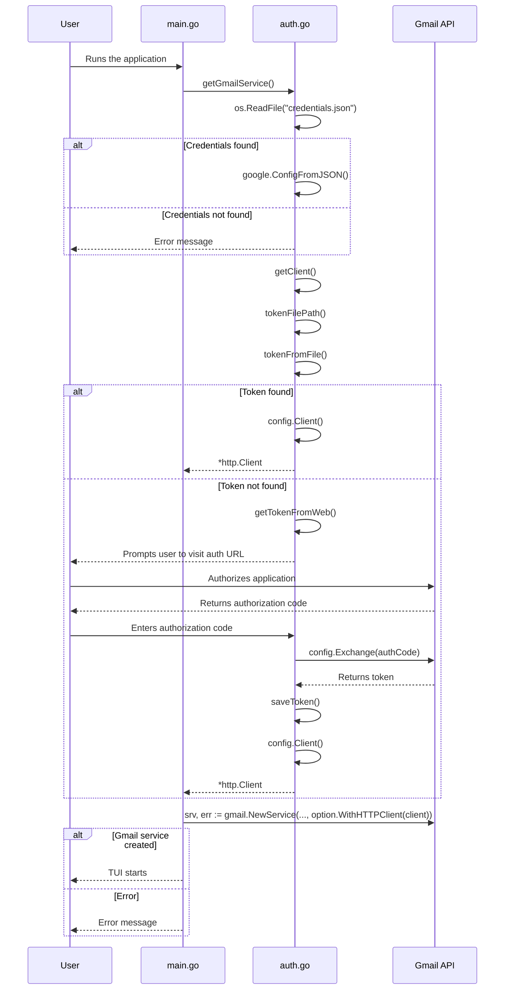

Currently only the basic functionality work
like compose a mail
read a mail
reply to a mail


replace the credential.json with yours and


## To test out the application 
- Go to google cloud console
- Add a project name it whatver eg. Gmail-TUI
- APIs and Services
- Library
- Gmail API
- Enable create an oauth2 token
- Download the credentials.json
- Replaces the placeholder credentials.json in this project with the downlaoded contents
- ```bash
  go mod tidy
  (OR)
  go install
  ```
- from the project root run
```bash
go run .
```


### Note on downloading attachments recieved from an email -> Check a downloads folder created in the same directory


```bash
go run .
```

and wait till it starts

## how it looks:


### ps first run always takes a bit longer but after that its chill


sequenceDiagram
    participant User
    participant main.go
    participant auth.go
    participant Gmail API
    User->>main.go: Runs the application
    main.go->>auth.go: getGmailService()
    auth.go->>auth.go: os.ReadFile("credentials.json")
    alt Credentials found
        auth.go->>auth.go: google.ConfigFromJSON()
    else Credentials not found
        auth.go-->>User: Error message
    end
    auth.go->>auth.go: getClient()
    auth.go->>auth.go: tokenFilePath()
    auth.go->>auth.go: tokenFromFile()
    alt Token found
        auth.go->>auth.go: config.Client()
        auth.go-->>main.go: *http.Client
    else Token not found
        auth.go->>auth.go: getTokenFromWeb()
        auth.go-->>User: Prompts user to visit auth URL
        User->>Gmail API: Authorizes application
        Gmail API-->>User: Returns authorization code
        User->>auth.go: Enters authorization code
        auth.go->>Gmail API: config.Exchange(authCode)
        Gmail API-->>auth.go: Returns token
        auth.go->>auth.go: saveToken()
        auth.go->>auth.go: config.Client()
        auth.go-->>main.go: *http.Client
    end
    main.go->>Gmail API: srv, err := gmail.NewService(..., option.WithHTTPClient(client))
    alt Gmail service created
        main.go-->>User: TUI starts
    else Error
        main.go-->>User: Error message
    end


## Authentication Flow


