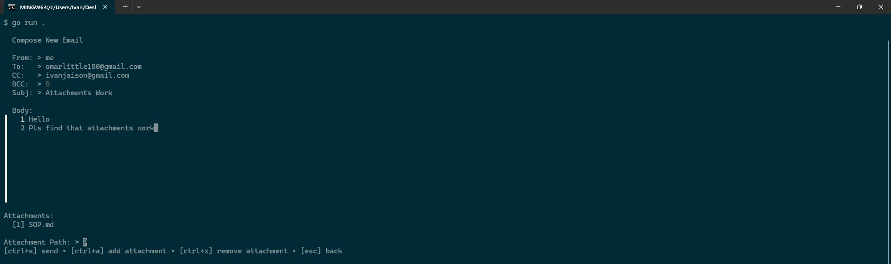
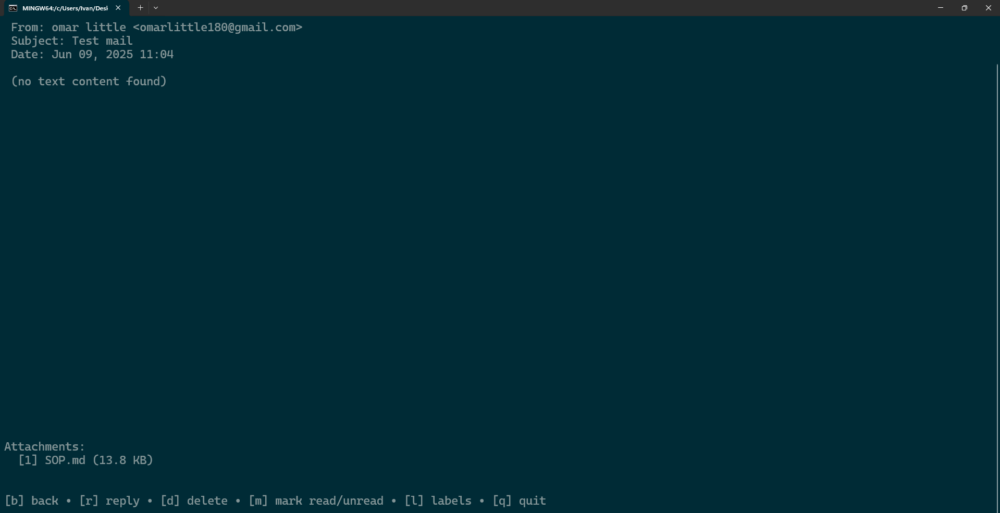

## To test it out

### Step 1: Create a Project in Google Cloud Console

- Go to the Google Cloud Console
- Click the project dropdown (top-left) > New Project
- Enter a project name (e.g., "Gmail-TUI") > Create

### Step 2: Enable Gmail API

- In the Cloud Console sidebar, navigate to APIs & Services > Library
- Search for "Gmail API" and select it
- Click Enable

### Step 3: Configure OAuth Consent Screen

- Go to APIs & Services > OAuth consent screen
- In Audience Enter your email as test user
- Add all the fmail andrequired scopes in `Data Acess`
- Create a client
- Download the json and save as credentials.json in repo root

### Step 4: First-Time Authorization

- Run your application with:

```bash
go mod tidy
go run .
```

- It will:
- Open a browser window asking you to log in to Google
- Show a warning screen (click Continue)
- Grant permission to your app
- Then `CHECK URL FOR CODE AND THEN INPUT TO PROMPT IN TERMINAL`
- This will generate a `~/.gmail-tui-token.json` file for future authentications

### Note on downloading attachments recieved from an email -> Check a downloads folder created in the same directory





## Authentication Flow


